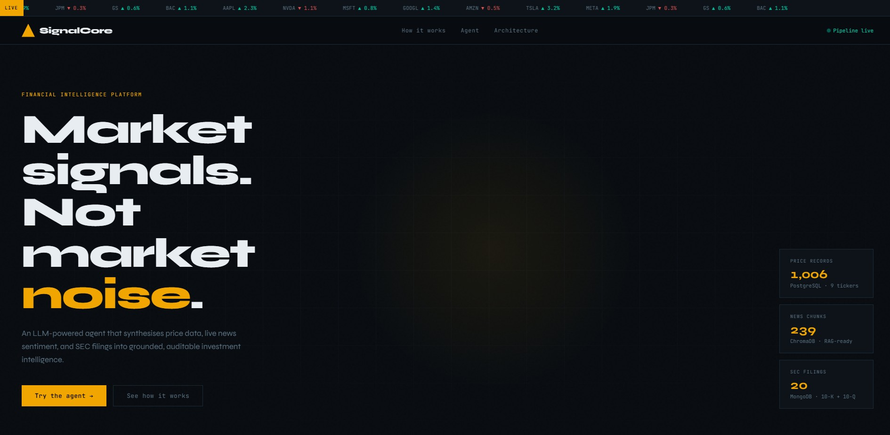
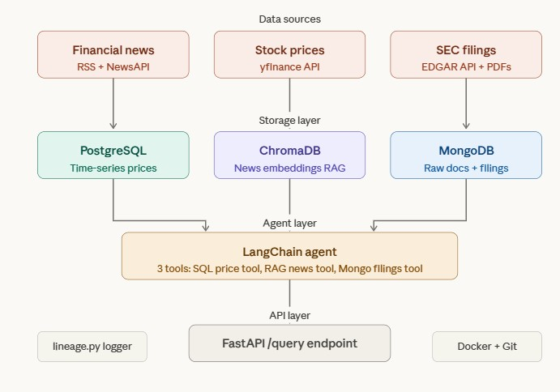
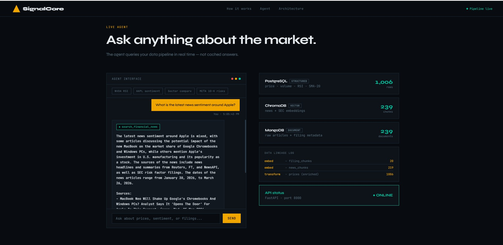
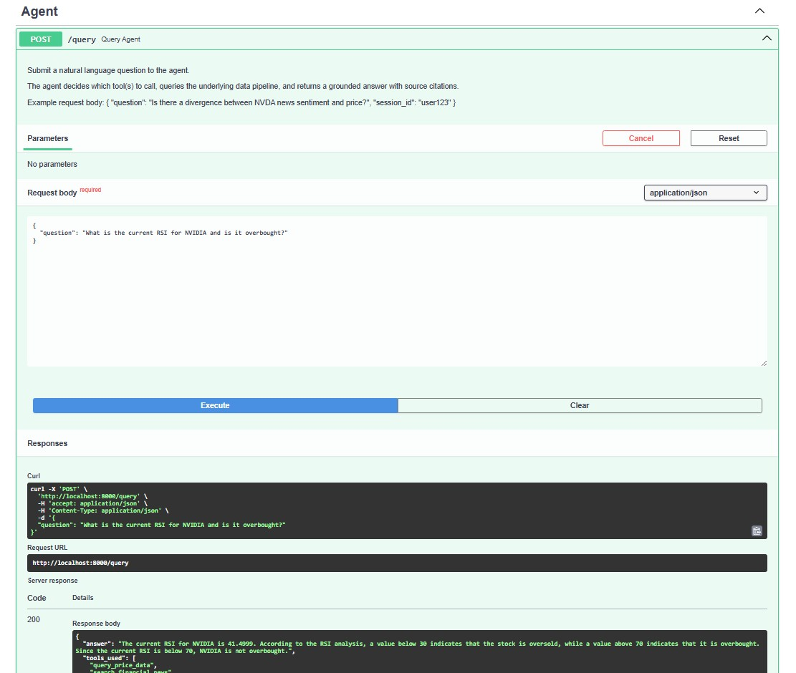

# Financial Signal Agent — MSIN0166 Data Engineering

> An LLM-powered financial intelligence platform that synthesises stock price data, live news sentiment, and SEC regulatory filings into grounded, auditable investment signals via a natural language agent interface.

**Module**: MSIN0166 Data Engineering · UCL School of Management · 2025/26  
**Stack**: Python · LangChain · Groq (Llama 3.3) · PostgreSQL · MongoDB · ChromaDB · FastAPI · Docker

---



---

## Architecture



---

## Project Structure

```
financial-signal-agent/
│
├── notebooks/
│   ├── 01_data_ingestion.ipynb   # Ingest prices, news, SEC filings
│   ├── 02_pipeline.ipynb         # Transform, embed into ChromaDB, lineage
│   └── 03_agent_demo.ipynb       # Live agent queries with tool traces
│
├── agent/
│   ├── tools.py                  # 3 LangChain tool definitions
│   └── agent.py                  # FinancialAgent class + system prompt
│
├── api/
│   └── app.py                    # FastAPI REST wrapper (CORS, /query, /lineage)
│
├── frontend/
│   └── index.html                # SignalCore UI — served at localhost:8000
│
├── scripts/
│   └── run_pipeline.py           # Cross-platform pipeline automation
│
├── images/                       # Screenshots and architecture diagrams
│
├── data/                         # Generated at runtime — not tracked in Git
│   ├── chroma/                   # ChromaDB vector store (persistent)
│   └── lineage/                  # lineage_log.jsonl — W3C Prov-aligned audit trail
│
├── docker-compose.yml            # PostgreSQL + MongoDB services
├── Dockerfile                    # Application container
├── requirements.txt              # Python dependencies
└── .env.example                  # Environment variable template
```

---

## Data Sources

| Source | Format | Storage | Agent Tool |
|---|---|---|---|
| Alpha Vantage API | Structured OHLCV | PostgreSQL | `query_price_data` |
| RSS feeds — Reuters, FT, Yahoo Finance (3 general + 10 ticker-specific) | Unstructured text | MongoDB + ChromaDB | `search_financial_news` |
| SEC EDGAR API — 10-K and 10-Q filings | Semi-structured documents | MongoDB + ChromaDB | `search_financial_news`, `get_filing_metadata` |

**Tickers monitored**: AAPL · NVDA · MSFT · GOOGL · AMZN · TSLA · META · JPM · GS · BAC

---

## Storage Architecture

| System | Content | Scale |
|---|---|---|
| PostgreSQL | OHLCV prices, SMA-20, RSI-14, price_change_pct, anomaly flags | ~1,000 rows · 9 tickers · 100 days |
| MongoDB `news_articles` | Headlines, summaries, ticker tags, source, url_hash | ~300 documents |
| MongoDB `sec_filings` | Ticker, form type, filing date, risk text, accession number | 20 documents |
| ChromaDB `news_chunks` + `filing_chunks` | 384-dim semantic vectors, all-MiniLM-L6-v2 | ~300 chunks |

---

## Agent in Action



The agent calls `search_financial_news`, retrieves ticker-tagged chunks from ChromaDB, cross-references SEC filings, and returns a cited answer with source dates.

---

## API



Every response includes the answer, which tools were invoked, source citations, and latency. Full API docs at `http://localhost:8000/docs`.

---

## Data Lineage

Every pipeline stage writes a W3C PROV-DM aligned record to `data/lineage/lineage_log.jsonl`:

```json
{
  "event": "embed",
  "source": "mongodb:news_articles",
  "destination": "chromadb:news_chunks",
  "rows_affected": 219,
  "agent": "02_pipeline.ipynb",
  "notes": "all-MiniLM-L6-v2 (HuggingFace), chunk_size=500, overlap=50"
}
```

Accessible live via `GET http://localhost:8000/lineage`.

---

## Quickstart

### Prerequisites
- Python 3.11+
- Docker Desktop
- PowerShell (Windows) or bash (Mac/Linux)

### 1. Clone and configure

```bash
git clone https://github.com/vedantbhatiaa/financial-signal-agent.git
cd financial-signal-agent
cp .env.example .env
# Fill in GROQ_API_KEY and ALPHA_VANTAGE_KEY in .env
```

### 2. Start infrastructure

```bash
docker compose up -d postgres mongo
```

> **Note for Windows + Anaconda users**: Anaconda bundles PostgreSQL on port 5432. Docker is configured on port 5433. Ensure `POSTGRES_URI` in `.env` uses port 5433.

### 3. Install dependencies

```bash
python -m venv venv
venv\Scripts\activate        # Windows
pip install -r requirements.txt
pip install langchain-groq langchain-huggingface sentence-transformers
nbstripout --install
```

### 4. Run the pipeline

```bash
# Option A — Jupyter notebooks (recommended, shows outputs)
jupyter notebook
# Run in order: 01_data_ingestion → 02_pipeline → 03_agent_demo

# Option B — automated
python scripts/run_pipeline.py
```

### 5. Start the API and frontend

```bash
uvicorn api.app:app --reload --port 8000
```

| Endpoint | Description |
|---|---|
| `http://localhost:8000` | SignalCore frontend |
| `http://localhost:8000/docs` | Interactive API documentation |
| `http://localhost:8000/query` | POST — submit a question to the agent |
| `http://localhost:8000/lineage` | GET — data lineage audit log |
| `http://localhost:8000/health` | GET — liveness check |

---

## Known Limitations

- **SEC risk text**: Filing metadata is fully ingested but full Item 1A text extraction uses a placeholder. In production, BeautifulSoup would parse the SEC HTML to extract the complete risk section.
- **Price history**: Alpha Vantage free tier returns 100 trading days. A paid tier provides full historical data.
- **News coverage**: RSS feeds capture articles available at ingestion time. A production system would run continuous scheduled ingestion for balanced ticker coverage.

---

## Module Learning Outcomes

| Learning Outcome | Implementation |
|---|---|
| Evaluate data processing strategies | Three-stage pipeline with documented design decisions per stage |
| Understand scaling options | PostgreSQL indexes, ChromaDB vector store, stateless agent tools |
| Explain effective data pipelines | Transform → Embed → Lineage with W3C Prov-aligned logging |
| Evaluate platform choices | Justified PostgreSQL vs MongoDB vs ChromaDB per data type |
| Evaluate technology trends | RAG, LLM agents, MCP-style tool interfaces, Docker containerisation |